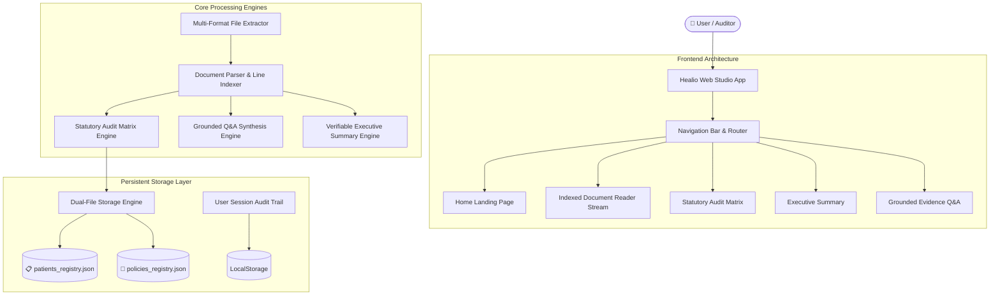

# 🏗️ Healio — System Architecture & Data Model

## 1. System Overview

**Healio** is a verifiable clinical intelligence and medical governance studio designed for medical boards, hospital administrators, healthcare providers, and clinical auditors. It parses multi-format medical records and hospital policies (PDF, Word DOCX/DOC, Text, RTF, CSV, JSON, HTML) into line-indexed statutory audit matrices, grounded evidence Q&A engines, and dual-file document registries with 100% verifiable source line citations.

---

## 2. Technology Stack

- **Core Framework**: [Next.js 16](https://nextjs.org/) (App Router, Turbopack, React 19)
- **Styling & UI Design**: Vanilla CSS3 (Custom Design Tokens, Cyber-Medical Dark Palette, Glassmorphism, Micro-Animations)
- **Document Extractors**:
  - `pdfjs-dist`: Native client-side PDF text stream parsing & line indexing
  - `mammoth`: DOCX Word document extraction
  - Custom parsers for Text, Markdown, CSV, JSON, HTML
- **Persistence Layer**: Browser `LocalStorage` Dual-Registry Engine with full JSON Export/Import backup support
- **CI/CD & Deployment**: GitHub Actions CI Pipeline & Vercel Automated Edge Production

---

## 3. High-Level Architecture Diagram



---

## 4. Data Models & Schemas

### 4.1 Document Record Schema
```typescript
interface DocumentRecord {
  id: string; // Unique identifier (e.g. custom-doc-172345678)
  title: string; // Document title
  category: "Patient Records" | "Telemedicine" | "Surgical" | "Compliance" | "General";
  targetFile: "patients" | "policies"; // Category registry target
  description: string; // Summary info (added date, total lines)
  addedAt: string; // ISO timestamp
  rawContent: string; // Raw unparsed document string
  isSample: boolean; // Flag for sample datasets
  structuredData: {
    metadata: DocumentMetadata;
    sections: DocumentSection[];
    summary: ExecutiveSummaryData;
    auditResults: AuditRuleResult[];
  };
}
```

### 4.2 Indexed Document Line Schema
```typescript
interface DocumentLine {
  lineNumber: number; // 1-indexed line number
  text: string; // Verbatim text line
  section?: string; // Extracted section header title
  tags?: string[]; // Tokenized keywords
}
```

### 4.3 Statutory Audit Matrix Result Schema
```typescript
interface AuditRuleResult {
  id: string; // Rule ID (e.g. RULE-PA-SUPERVISION)
  category: string; // Governance category
  title: string; // Human-readable rule title
  status: "VIOLATION" | "ADVISORY" | "COMPLIANT";
  findings: string; // Statutory analysis findings
  citation?: {
    startLine: number;
    endLine: number;
  };
  verbatimQuote?: string; // Exact text quote from source document
  recommendation: string; // Actionable clinical fix
}
```

### 4.4 Grounded Q&A Verification Schema
```typescript
interface GroundedQAResponse {
  answer: string; // Evidence-grounded answer text
  confidence: number; // 0-100 evidence confidence score
  citation?: {
    startLine: number;
    endLine: number;
  };
  excerpts: Array<{
    lineNumber: number;
    section: string;
    text: string;
  }>;
  reasoning: string[]; // Chain of thought evidence verification steps
}
```

### 4.5 User Session Audit Log Schema
```typescript
interface UserActivityLog {
  id: string; // Unique log ID
  user: string; // Name of active user/auditor
  action: string; // Action description (e.g. Loaded Document)
  details: string; // Specific details (e.g. Document title)
  timestamp: string; // ISO timestamp
}
```

---

## 5. Security & Grounded Evidence Protocol

1. **Zero Hallucination Enforcement**: Answers in the Grounded Q&A engine are generated strictly from verbatim source lines extracted from the loaded document.
2. **Line Citation Verification**: Every finding and answer includes a `[Line X-Y]` citation pill that auto-routes the user to the **Document Reader Stream** and scrolls directly to that line.
3. **Data Loss Prevention**: Dual-file registry backups (`patients_registry.json` and `policies_registry.json`) are stored locally and can be exported/imported at any time.
